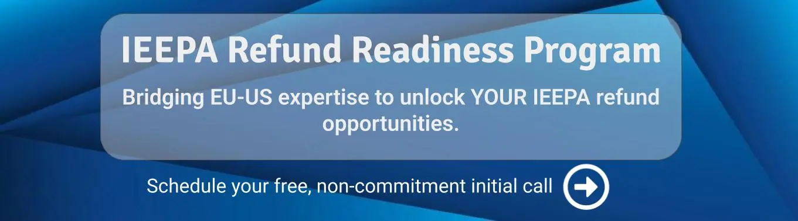

> In February 2026, the U.S. Supreme Court struck down President Trump's "reciprocal" tariffs imposed under the International Emergency Economic Powers Act (IEEPA), creating a pathway for over $175 billion in refunds. While this sounds like welcome news for the millions of U.S. consumers who paid higher prices due to these tariffs, the reality is starkly different: individual buyers will likely never see a single dollar of those refunds. Here's why the legal structure of customs duty payments means the money flows back to importers of record and not the consumers who ultimately bore the cost.

## Who Paid the Tariffs?

This question has dominated conversations since President Trump decided to increase tariffs as a measure of protection for the U.S. economy. His position has consistently been that "countries" pay for the tariff. It was never very clear whether the "country" was the country of production or the country where goods are shipped from, which, in many cases, are distinct.

But regardless, the direct payor of tariff in any country in the world is the importer. In the U.S., this entity is known as the **Importer of Record (IOR)**. But the IOR varies depending on the nature of the seller's strategy, and they can also pass duty and tax charges to another party (i.e., the individual U.S. citizen buying the goods), which makes the situation look very different from reality.

To illustrate this complexity, let's examine the case of a B2C sale from a non-U.S. seller to a U.S. individual buyer.

### The Case of a Non-US Brand Selling eCommerce Orders to US Individual Buyers

Let's start from the buyer experience. Since de minimis was suspended in the U.S., every single product imported to the U.S. is dutiable unless it's covered by a specific trade agreement. In the case of eCommerce, 99% of the time, the buyer will pay for duty and taxes, either upon delivery of the order at their door (increasingly less common due to poor customer experience), or, in the vast majority of cases, during the checkout process. This is called a DDP transaction, that stands for Delivery Duty Paid.

Buyers see separate line items on their invoice for duty and taxes. It is therefore fairly unquestionable to state that **the U.S. individual buyer pays for the tariff** as the invoice was increased by that amount.

But does this mean the U.S. individual is the importer? **No, it is almost never the case.**

Why? Because tariff must be paid to Customs authorities by an entity that has provided a guarantee that payment will be made. This is called a **Customs Bond**. Individuals do not have that. Customs brokers, freight forwarders, and some registered U.S. companies do. (In some cases, non-U.S. registered companies can also play that role, but for the sake of this article, we'll leave that option aside.)

In other words, regardless of who eventually ends up with a tariff line on their invoice, the party that really matters to U.S. Customs is the entity who paid tariff **TO** Customs. And that is the IOR.

{: .mx-auto .d-block}

### Who Is the IOR in B2C Sales Transactions?

The situation depends on the nature of the goods and the carrier/broker. Let's start from the most common scenario: a non-U.S. retailer ships sold orders directly from inventory located outside the U.S. to the consumer. They will most likely use an express carrier like FedEx, UPS, or DHL to do that.

The seller can decide to be the IOR. For that, they need to have a U.S. registered company and a bond with Customs. They will instruct the carrier accordingly, and the seller (i.e., their U.S. entity) will pay duties and taxes directly to Customs.

The other scenario, in case the seller does not decide to be the IOR or cannot be, is for the carrier/broker to assume that role. This is usually limited to highly compliant goods of low value. To expedite the import clearance process, the carrier will clear goods, pay tariff to CBP, and charge them back to the seller.

**Critical point**: In both scenarios, the individual consumer is **never** the Importer of Record, even though they paid the tariff amount through their purchase price or at checkout.

## Who Will Be Refunded with "Reciprocal" Tariff Refunds?

Quite naturally, the answer is that **the entity who paid tariff to Customs is the one that will be refunded by Customs**. As the reader can see, in almost 100% of cases, it won't be the consignee or the individual buyer, although, by the pass-through fee mechanism, they paid the amount.

But it may also not be the seller. If they let the carrier/broker be the IOR, then the carrier will be refunded with no legal obligation to pass on the refund.

According to Judge Richard Eaton of the U.S. Court of International Trade, who ruled on March 4, 2026, "all importers of record" are "entitled to benefit" from the Supreme Court ruling that struck down the IEEPA tariffs. This ruling clarified that refunds flow to the legal importer, not to downstream buyers or individual consumers who absorbed the costs through higher prices.

### The Refund Process: Where Individual Buyers Are Left Out

CBP announced in early March 2026 that it is building a new system within the ACE portal to process tariff refunds. The system is expected to be operational within 45 days of the announcement and will allow eligible **importers of record** to file declarations for entries on which IEEPA duties were paid.

The process works as follows:

* The importer files a declaration in ACE that includes a list of entries on which IEEPA duties were paid
* ACE runs validations on each entry and automatically recalculates the duty owed without the IEEPA tariffs (with applicable interest)
* CBP verifies the declaration and processes refunds as soon as practicable

**Individual consumers are completely excluded from this process.** As consumer advocacy sites have confirmed, "Individual consumers generally cannot file for tariff refunds. Tariffs are paid by the importer of record at the point of importation, not by the end consumer".

## Is There an Option for Sellers to Control That Mechanism?

Yes, and that involves a **Power of Attorney (POA) and a third party broker**. The seller can ask the IOR for a POA to allow a third-party broker to claim the refund and control the flow of funds, ensuring that it will eventually end up in the seller's bank account rather than being retained by the carrier or freight forwarder.

For B2C transactions, this requires foresight and contractual arrangements made **before** the tariff payments occurred. For the millions of individual transactions that have already taken place, obtaining retroactive POAs is impractical to impossible.

## Lessons for the Future

For international retailers selling to U.S. consumers, the lesson is clear: **Control your destiny and your cost structure. Be the Importer of Record.**

By acting as the IOR, sellers:

* Maintain direct control over customs filings and duty payments
* Ensure any duty refunds, drawbacks, or remissions flow directly back to them
* Have the legal standing to file refund claims, protests, and duty drawback applications
* Can make strategic decisions about duty optimization programs

For individual U.S. consumers, the reality is sobering: while you paid higher prices because of tariffs included in your purchases, you have no legal mechanism to recover those costs when the tariffs are ruled unconstitutional. The approximately $175 billion in refunds will flow to the roughly 301,000 U.S. importers of record—major retailers like Costco, Walmart, and Target, along with express carriers and freight forwarders.

Whether those companies choose to pass savings back to consumers through lower prices is entirely at their discretion. There is no legal requirement to do so.