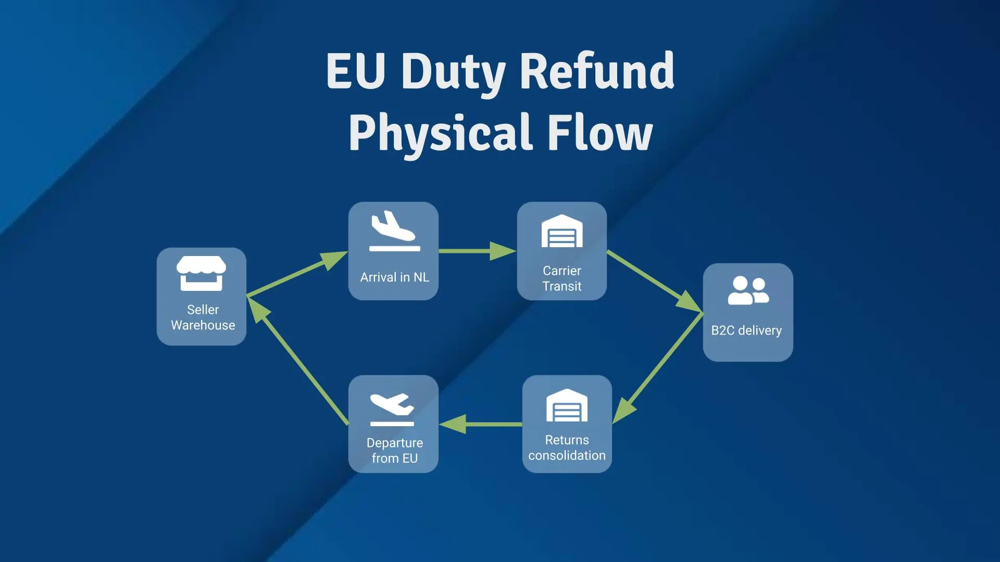

> In 2026, the EU's customs landscape for e-commerce is shifting dramatically. The €150 duty-free threshold disappears July 1st, replaced by a fixed €3 or a commodity based ad-valorem customs duty on low-value parcels. But for EU retailers managing B2C returns, there's a powerful, and often overlooked, recovery mechanism: Returned Goods Relief (RGR) and EU duty refund. If you're shipping products internationally and accepting returns, understanding these procedures could recover thousands in annual duty costs.

## The 2026 EU Customs Reset: What's Changing

The European Commission has confirmed two major changes affecting cross-border e-commerce:

**July 1, 2026: €3 Fixed Customs Duty**

- Applies to every low-value item under €150 by tariff heading
- Affects approximately 93% of B2C e-commerce flows into the EU
- Replaces the current €150 duty-free exemption

**November 2026 (Pending): EU-Wide Handling Fees**

- Additional handling fee expected (€2 proposed)
- Charged per parcel entering the EU and cleared using the simplified e-commerce dataset.

For finance decision-makers at EU retailers, this creates a dual challenge: **rising import costs on incoming stock** and **need for operational changes on returned items**.

## The RGR Advantage: Recovering Duty on Returns

Returned Goods Relief (RGR) is your primary tool for duty recovery. This procedure allows goods exported from the EU to be re-imported **without paying customs duty and VAT** if specific conditions are met.

  <strong>Read our Ask the Experts article featuring Elke Rödel: What is Returned Goods Relief and Who Can Benefit?</strong>

**The Math on Returns:**

For a mid-sized EU apparel retailer shipping 5,000 units monthly internationally:

- Average import duty rate on returns: 7-12%
- Average product value: €60
- Monthly duty exposure: 5,000 × €60 × 10% = **€30,000**

(this calculation applies from July 1st 2026 onwards)

With RGR properly implemented, that duty avoidance or recovery becomes available, protecting margins that would otherwise erode in a high-return environment like fashion e-commerce (22-25% average return rate).

## EU Duty Refund: The Complementary Recovery Mechanism

EU duty refund operates differently from US drawback programs. Instead of filing formal claims, EU retailers benefit from an automated claim for refund process on all orders returned by buyers and exported from the EU.

**How does duty refund on returned goods work?**

{: .mx-auto .d-block}

EU Duty Refund is built on a very simple process that fits with how retailers usually process eCom orders. Goods enter the EU via the Netherlands, get cleared by Customs there and follow their journey until the consignee's place. When buyers return orders, items are sent to a consolidation center in one of the 27 member states and are exported back out of the European Union.

At that time the claim for duty refund can be submitted to the Customs authorities.

  <strong>TDR has designed a unique EU Duty Refund solution for crossborder B2C eCommerce. Check our Get Started With EU Duty Refund page for more information</strong>

## Four Critical Takeaways for Finance and Supply Chain Leaders

1. **The €150 threshold dies July 1, 2026.** Landed cost models must account for €3 duty minimum on all low-value parcels, plus member-state handling fees.

2. **The EU will implement a EU wide handling fee on eCom orders**. At the time of publishing this article, the implementation date is expeted to be November 2026 and should be €2 per package entering the European Union

3. **Tariffs (aka Import Duties) can be reclaimed on returned eCom orders**. [Talk to the TDR customs experts team](https://tradedutyrefund.com/contact-us.html?utm_source=Blog&utm_medium=Post&utm_campaign=20260319) to setup an easy, compliant and frictionless duty refund solution.

4. **RGR can offset 50-70% of return-related duty exposure** if EU-origin goods or previous importation into the EU and proper documentation exist. Audit your return profile now.

---

**Have questions about RGR, duty refund, or structuring your return supply chain for 2026?** Our team of customs experts can audit your current processes, identify hidden recovery opportunities, and design an RGR program that protects margins through the EU's customs reform transition.

[Contact our team today for a confidential consultation](https://tradedutyrefund.com/contact-us.html?utm_source=Blog&utm_medium=Post&utm_campaign=20260319)
---

**About Trade Duty Refund (TDR)**

TDR helps European and US retail brands recover customs duties across complex international supply chains. With expertise in EU Duty Refund, Returned Goods Relief, US duty drawback, IEEPA tariff recovery, and VAT refunds, we've helped clients recover over millions in unclaimed duties. Our mission: turn compliance complexity into competitive advantage.

To help navigate these changes, use [our free and anonymous cost impact calculator](https://tradedutyrefund.com/eu-2026-import-regulations-cost-impact-tool.html?utm_source=Blog&utm_medium=Post&utm_campaign=20260319). Get valuable insights into how the new EU customs framework may affect your operations. Proactively modeling these costs now can make a significant difference in maintaining competitiveness once the new rules come into force.
